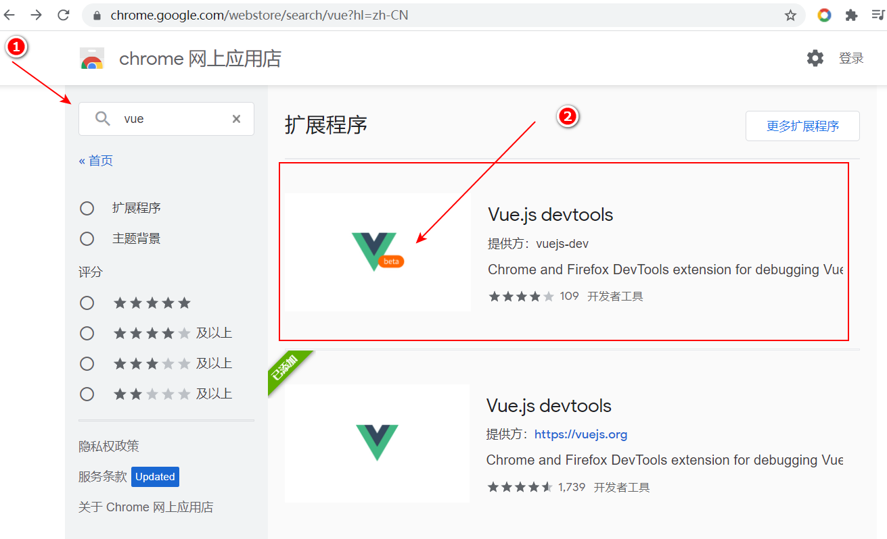

# 学习 vue3

## 1. 简介

发布：

* 2020年9月18日，vue.js 发布 3.0 版本（[vue-next](https://github.com/vuejs/vue-next)），代号 One Piece（海贼王）

性能提升：（快、好、省）

* 打包减少 41%
* 初次渲染 55%，更新渲染快 133%
* 内存减少 54%

源码的升级：

* 响应式： 使用 `Proxy` 替代 `Object.defineProperty`
* 重写 VDOM，Tree-Shaking

更好的支持 TS：

* 官方支持而非通过 loader 

新的特性：

* Composition API（组合API）
  * setup
  * ref、reactive
  * watch、 watchEffect
  * provide、inject

* 新内置组件
  * `<Fragment>`
  * `<Teleport>`
  * `<Suspense>`

其他改变：

* 新的生命周期函数
* data 选项应始终被声明为一个函数： data 的值只能为函数了
* 移除 keyCode （v-on 修饰符） : `@key-up.enter`， `@key-up.13`，后者不可用了

## 2. vue3 工程

### 2.1. 创建 vue3 工程

#### 2.1.1. 使用 vue-cli 4.5.0+ 创建

```shell
# 安装/升级 到 4.5.0 以上
npm i -g @vue/cli

# + @vue/cli@4.5.15

# 创建项目（使用管理员权限打开 CMD），选择 vue3
vue create vue3-by-cli

# 启动
cd vue3-by-cli
npm run serve
```

#### 2.1.2. 使用 vite 创建

vite： 

* 官网：[https://vitejs.cn/](https://vitejs.cn/)
* 新一代前端构建工具（相对 webpack 来说），尤雨溪团队开发的

优势：

* 开发环境中，无需打包操作，可快速冷启动。（也就是说省掉了 bundle 的过程）
* 轻量快速的热重载（HMR，hot module replacement）
* 按需编译，无需编译所有模块
* 传统编译 从入口开始打包所有依赖，vite 用哪个模块编译哪个模块

创建工程：

```shell
npm init @vitejs/app

# √ Project name: ... vue3-by-vite
# √ Select a framework: » vue
# √ Select a variant: » vue

# Done. Now run:   

#  cd vue3-by-vite
#  npm install
#  npm run dev

cd vue3-by-vite
npm i
npm run dev
```

总结：

* vite 确实比 webpack 快
* 但没有大规模应用，还有许多坑要踩。（也就是说 现阶段还是用 webpack）

#### 2.1.3. 使用 webpack5 创建

>>最小配置

相关依赖：

```shell
npm i -D webpack webpack-cli webpack-dev-server html-webpack-plugin

# 注意 vue3 和 loader 都要加 @next
npm i -D vue-loader@next
npm i vue@next
```

package.json：

```json
{
  "scripts": {
    "dev": "webpack serve"
  },
  "dependencies": {
    "vue": "^3.2.23"
  },
  "devDependencies": {
    "html-webpack-plugin": "^5.5.0",
    "vue-loader": "^16.8.3",
    "webpack": "^5.64.4",
    "webpack-cli": "^4.9.1",
    "webpack-dev-server": "^4.6.0"
  }
}
```

webpack.config.js:

```javascript
const path = require('path');
const { VueLoaderPlugin } = require('vue-loader')
const HtmlWebpackPlugin = require('html-webpack-plugin');

module.exports = {
  mode: 'development',
  devtool: "source-map",
  entry: './src/main.js',
  output: {
    path: path.resolve(__dirname, "dist"),
    filename: '[name].js'
  },
  devServer: {
    port: 8080,
    open: true,
    hot: true,
  },
  module: {
    rules: [
      {
        test: /\.vue$/,
        use: [
          'vue-loader'
        ]
      }
    ]
  },
  plugins: [
    new HtmlWebpackPlugin({
      filename: 'index.html',
      template: path.resolve(__dirname, "index.html"),
    }),
    new VueLoaderPlugin()
  ],
};
```

### 2.2. vue3 工程结构分析

分析入口文件：

* main.js
* App.vue

#### 2.2.1. main.js

vue2 的写法：

```javascript
const vm = new Vue({
  render: h ==> h(App)
});

vm.$mount('#app');
```

vue3 的写法： 

```javascript
import { createApp } from 'vue'
import App from './App.vue'

createApp(App).mount('#app')
```

createApp 为工厂函数，用于创建根实例（app）

比 vue2 的 vm 更轻量（没有那么多属性和方法）

#### 2.2.2. App.vue

```html
<template>
  
  <HelloWorld msg="Welcome to Your Vue.js App"/>
</template>

<script>
import HelloWorld from './components/HelloWorld.vue'

export default {
  name: 'App',
  components: {
    HelloWorld
  }
}
</script>
```

vue3 中的模板（`<template>`）中可以有多个根标签

## 3. vue devtools

通过 Chrome 网上应用店安装：



## 4. 常用 Composition API

* 组合式 API
* 选项式 API，vue2 中 `data`、`methods`、`computed` 等 就是选项式 API

### 4.1. 初识 setup

定义：

* vue3 中的一个新的配置项，值为 **函数**
* `setup` 是所有 Composition API 的“舞台”，也就是说组合式 API 要写在 `setup` 中

返回值：

* 对象：对象的属性、方法都可以直接在模板中使用。（类比 vue2 中的 `data` 属性）
* 函数：渲染函数，可直接自定义渲染内容

注意点：

* 选项式API（`data`/`methods`/`computed`...）中可以直接访问 `setup` 返回的属性和方法
* 属性、方法如有重名，`setup` 的优先级更高
* `setup` 不能访问选项式 API
* `setup` 不能是 async 函数

示例：

```html
<template>
  <h1>个人信息：</h1>
  <div>姓名： {{ name }}</div>
  <div>年龄： {{ age }}</div>
  <div>性别： {{ gender }}</div>
  <button @click="sayHelloByCompositionAPI">vue3 的写法</button>
  <button @click="sayHelloByOptionAPI">vue2 的写法</button>
</template>
<script>
export default {
  setup() {
    // data （非响应式）
    const name = 'zhangsan';
    const age = 18;

    // method
    const sayHelloByCompositionAPI = () => {
      console.log('组合式 API：', name, age);
    };

    return {
      name,
      age,
      sayHelloByCompositionAPI,
    };
  },

  // 不建议使用这种方式
  data() {
    return {
      gender: '男'
    };
  },
  methods: {
    sayHelloByOptionAPI() {
      // 可以读取 setup 中返回的对象的属性和方法
      console.log('选项式 API', this.name, this.age, this.gender);
    }
  },
}
</script>
```

### 4.2. ref 函数

### 4.3. reactive 函数

### 4.4. vue3 中响应式的原理

### 4.5. setup 注意点

### 4.6. reactive VS ref

### 4.7. 计算属性 和 watch

### 4.8. 生命周期

### 4.9. 自定义 hook 函数

### 4.10. toRefs